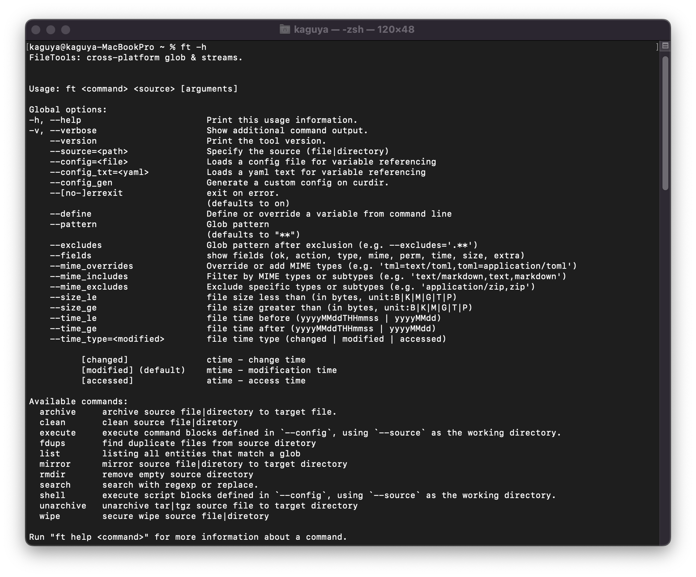
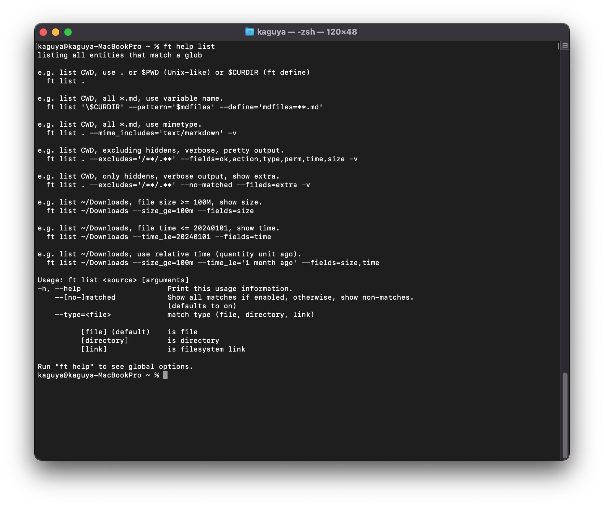
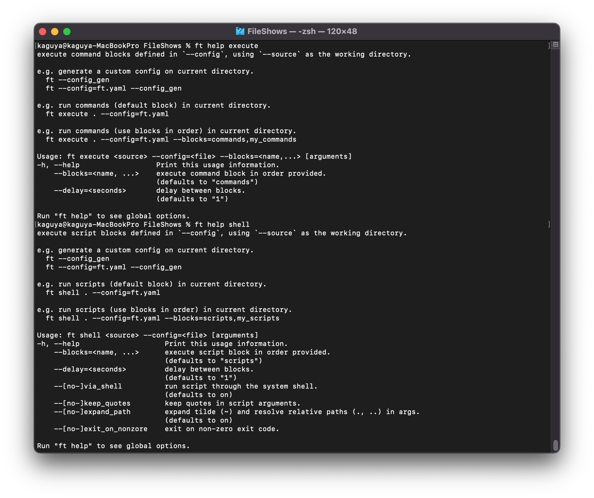
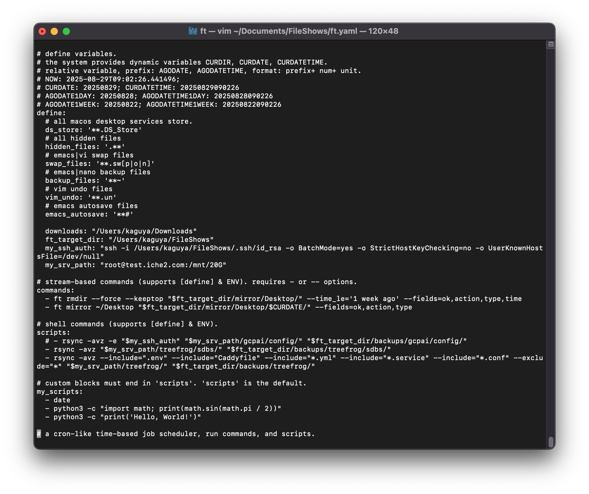
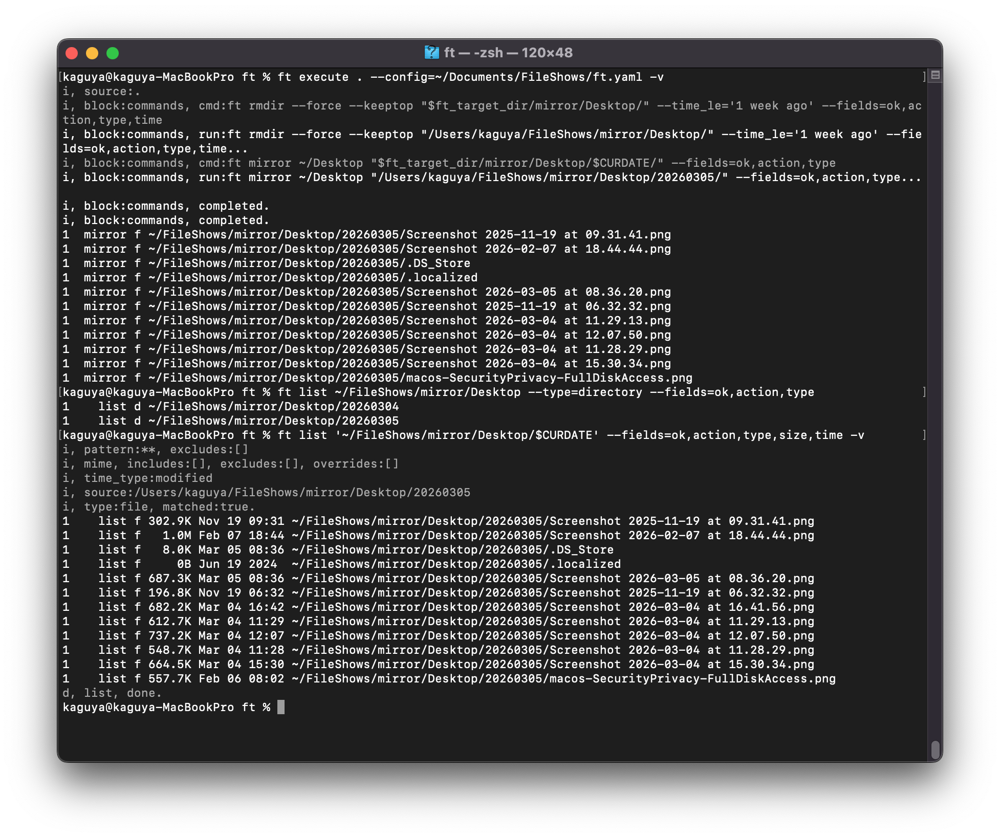
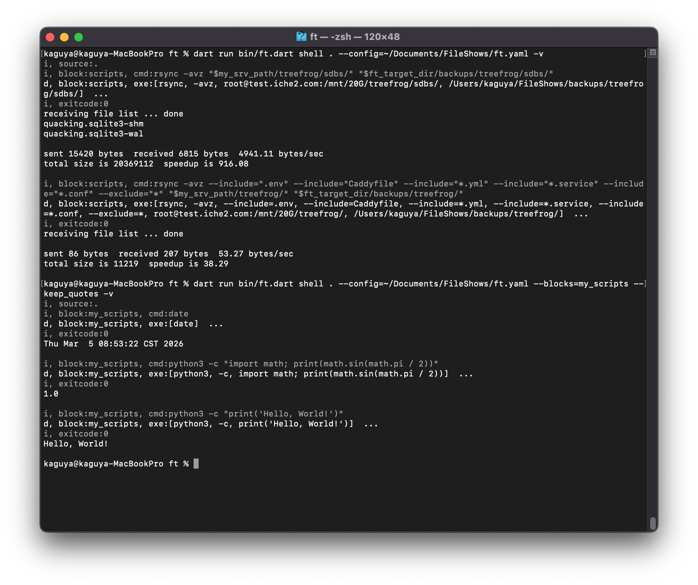

#### Running `ft help` will display an overview of all global options and available subcommands

---

#### the example output for the `list` subcommand, fully demonstrating how to combine global parameters for file matching and filtering.

---

#### Automation & Orchestration Subcommands 

- `execute`: Batch run `ft` internal subcommands 
- `shell`: Batch run native system CLI applications

---

#### Automation & Orchestration use YAML configuration example.

---

#### `execute`: Batch run `ft` internal subcommands (via YAML configuration).

---

#### `shell`: Batch run native system CLI applications (via YAML configuration).

